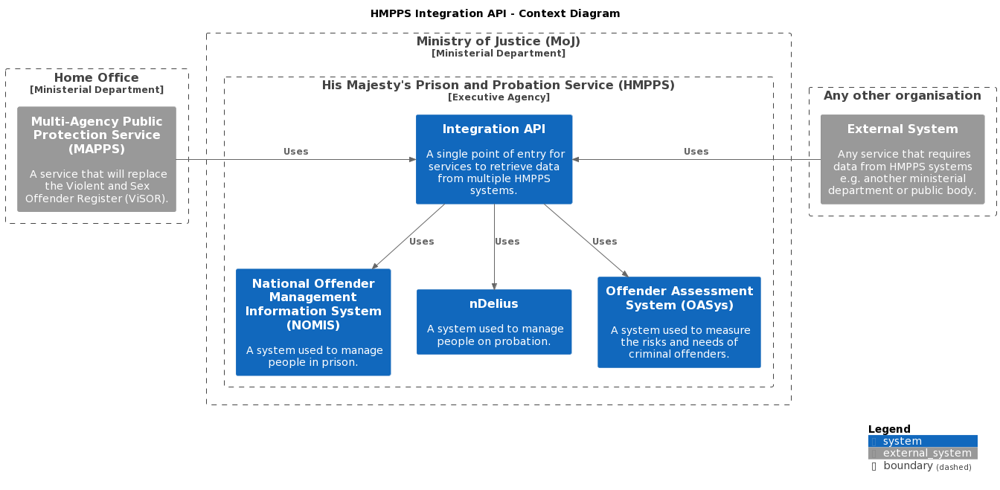

# HMPPS Integration API

[](https://operations-engineering-reports.cloud-platform.service.justice.gov.uk/public-github-repositories.html#hmpps-integration-api "Link to report")
[](https://circleci.com/gh/ministryofjustice/hmpps-integration-api)
[](https://hmpps-integration-api-development.apps.live.cloud-platform.service.justice.gov.uk/swagger-ui/index.html)

## Contents

- [About this project](#about-this-project)
- [Getting started](#getting-started)
    - [Using IntelliJ IDEA](#using-intellij-idea)
- [Usage](#usage)
    - [Running the application](#running-the-application)
        - [With dependent services](#with-dependent-services)
    - [Running the tests](#running-the-tests)
    - [Running the linter](#running-the-linter)
    - [Running all checks](#running-all-checks)
    - [Request logging](#request-logging)
- [Documentation](#documentation)
- [Useful commands](#useful-commands)
    - [kubectl](#kubectl)
    - [aws](#aws)
- [License](#license)

## About this project

A long-lived API that exposes data from HMPPS systems such as the National Offender Management Information System (
NOMIS), nDelius (probation system) and Offender Assessment System (OASys), providing a single point of entry for
consumers. It's built using [Spring Boot](https://spring.io/projects/spring-boot/) and [Kotlin](https://kotlinlang.org/)
as well as the following technologies for its infrastructure:

- [AWS](https://aws.amazon.com/) - Services utilise AWS features through Cloud Platform such
  as [Elastic Container Registry (ECR)](https://aws.amazon.com/ecr/) to store our built artifacts. The CI/CD pipeline
  stores and retrieves them from there as required.
- [CircleCI](https://circleci.com/developer) - Used for our build platform, responsible for executing workflows to
  build, validate, test and deploy our project. (_This may yet be switched for GitHub Actions depending on
  investigation._)
- [Cloud Platform](https://user-guide.cloud-platform.service.justice.gov.uk/#cloud-platform-user-guide) - Ministry of
  Justice's (MoJ) cloud hosting platform built on top of AWS which offers numerous tools such as logging, monitoring and
  alerting for our services.
- [Docker](https://www.docker.com/) - The API is built into docker images which are deployed to our containers.
- [Kubernetes](https://kubernetes.io/docs/home/) - Creates 'pods' to host our environment. Manages auto-scaling, load
  balancing and networking to our application.



## Getting started

### Using IntelliJ IDEA

When using an IDE like [IntelliJ IDEA](https://www.jetbrains.com/idea/), getting started is very simple as it will
handle installing the required Java SDK and [Gradle](https://gradle.org/) versions. The following are the steps for
using IntelliJ but other IDEs will prove similar.

1. Clone the repo.

```bash
git clone git@github.com:ministryofjustice/hmpps-integration-api.git
```

2. Launch IntelliJ and open the `hmpps-integration-api` project by navigating to the location of the repository.

Upon opening the project, IntelliJ will begin downloading and installing necessary dependencies which may take a few
minutes.

## Usage

### Running the application

To run the application using IntelliJ:

1. Select the `HmppsIntegrationApi` run configuration file.
2. Click the run button.

To run the application using the command line:

```bash
./gradlew bootRun
```

Then visit [http://localhost:8080](http://localhost:8080).

#### With dependent services

It's possible to run the application with dependent services like
the [NOMIS / Prison API](https://github.com/ministryofjustice/prison-api)
and [HMPPS Auth](https://github.com/ministryofjustice/hmpps-auth) with Docker
using [docker-compose](https://docs.docker.com/compose/).

1. Build and start the containers for each service.

```bash
make serve
```

Each service is then accessible at:

- [http://localhost:8080](http://localhost:8080) for this application
- [http://localhost:8081](http://localhost:8081) for the Prison API
- [http://localhost:9090](http://localhost:9090) for the HMPPS Auth service

As part of getting the HMPPS Auth service running
locally, [the in-memory database is seeded with data including a number of clients](https://github.com/ministryofjustice/hmpps-auth/blob/main/src/main/resources/db/dev/data/auth/V900_0__clients.sql)
. A client can have different permissions i.e. read, write, reporting, although strangely the column name is called
​​autoapprove.

In order to call endpoints of the Prison API, an access token must be provided that is generated from the HMPPS Auth
service.

2. Generate a token for a HMPPS Auth client.

```bash
curl -X POST "http://localhost:9090/auth/oauth/token?grant_type=client_credentials" \
  -H 'Content-Type: application/json' \
  -H "Authorization: Basic $(echo -n "prisoner-offender-search-client:clientsecret" | base64)"
```

This uses the client ID: `prisoner-offender-search-client` and the client secret: `clientsecret`. A number of seeded
clients use the same client secret.

A JWT token is returned as a result, it will look like this:

```json
{
  "access_token": "eyJhbGciOiJSUzI1NiIs ...BAtWD653XpCzn8A",
  "token_type": "bearer",
  "expires_in": 3599,
  "scope": "read write",
  "sub": "prisoner-offender-search-client",
  "auth_source": "none",
  "jti": "Ptr-MIdUBDGDOl8_qqeIuNV9Wpc",
  "iss": "http://localhost:9090/auth/issuer"
}
```

Using the value of `access_token`, you can call the Prison API using it as a Bearer Token.

There are a couple of options for calling the Prison API such as [curl](https://curl.se/)
, [Postman](https://www.postman.com/) and using in-built Swagger UI via the browser
at [http://localhost:8081/swagger-ui/index.html](http://localhost:8081/swagger-ui/index.html) which documents the
available API endpoints.

### Running the tests

The testing framework used in this project is [Kotest](https://kotest.io/).

To run the tests using IntelliJ:

1. Install the [Kotest IntelliJ plugin](https://kotest.io/docs/intellij/intellij-plugin.html).

This provides the ability to easily run a test as it provides run buttons (gutter icons) next to each test and test
file.

2. Click the run button beside a test or test file.

To run all tests using the command line:

```bash
make test
```

To run unit tests using the command line:

```bash
make unit-test
```

### Running the linter

To lint the code using [Ktlint](https://pinterest.github.io/ktlint/):

```bash
make lint
```

To autofix any styling issues with the code:

```bash
make format
```

### Running all checks

To run all the tests and linting:

```bash
make check
```

### Request Logging
This can be done within `logback-spring.xml`. To enable request logging, update the value of the 'level' property within
the logger named "<application>.config.RequestLogger" to the desired [logger level](https://docs.spring.io/spring-boot/docs/2.1.13.RELEASE/reference/html/boot-features-logging.html).

```
    <logger name="uk.gov.justice.digital.hmpps.hmppsintegrationapi.config.RequestLogger" additivity="false" level="DEBUG">
        <appender-ref ref="logAppender"/>
        <appender-ref ref="consoleAppender"/>
    </logger>
```

Note, this will only specifically enable the RequestLogger.

## Documentation
- [Updating diagrams](/docs/updating-diagrams.md)
- [Setting up a CircleCI context for deployment](/docs/setting-up-circleci-context-for-deployment.md)

## Useful commands

### kubectl

To report on all resources for an environment, run the script:

```bash
./scripts/report_kubernetes.sh <environment>
# E.g ./scripts/report_kubernetes.sh development
```

<details>
  <summary>Alternatively, the commands to yield information on specific resources.</summary>
  <br>

To get ingress information for a namespace:

  ```bash
  kubectl get ingress -n <namespace>
  ```

To get a list of all services for a namespace:

  ```bash
  kubectl get service -n <namespace>
  ```

To get a list of all deployments for a namespace:

  ```bash
  kubectl get deployment -n <namespace>
  ```

To get a list of all pods for a namespace:

  ```bash
  kubectl get pod -n <namespace>
  ```

To get detailed information on a specific pod:

  ```bash
  kubectl describe pod <podname> -n <namespace>
  ```

To view logs of a pod:

  ```bash
  kubectl logs <pod-name> -n <namespace>
  ```

To perform a command within a pod:

  ```bash
  kubectl exec <pod-name> -c <container-name> -n <namespace> <command>
  # E.g. kubectl exec hmpps-integration-api-5b8f4f9699-wbwgf -c hmpps-integration-api -n hmpps-integration-api-development -- curl http://localhost:8080/
  ```

To delete all ingress, services, pods and deployments:

  ```bash
  kubectl delete pod,svc,deployment,ingress --all -n <namespace>
  ```

</details>

### aws

To list images in the ECR repository:

```bash
aws ecr describe-images --repository-name=hmpps-integration-api-admin-team/hmpps-integration-api-<environment>-ecr
```

## License

[MIT License](LICENSE)
