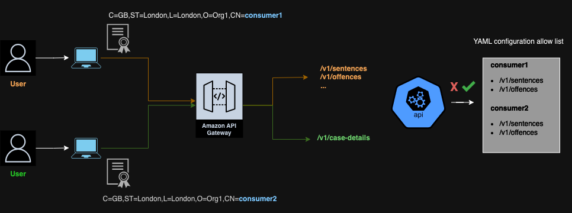

# Authentication and Authorisation

This service restricts access by authenticating and authorising each request.
Consumers need to be explicitly added before they can access any of the endpoints.

## Authentication

The primary authentication mechanism is [mutual TLS provided by API Gateway](https://docs.aws.amazon.com/apigateway/latest/developerguide/rest-api-mutual-tls.html).

To identify consumers there is also an API key that needs to be sent by the consumer as a header `x-api-key`, which belongs to a [Usage Plan](https://docs.aws.amazon.com/apigateway/latest/developerguide/api-gateway-api-usage-plans.html).

For setup instructions on adding new consumers please see [Setting up a new consumer](./guides/setting-up-a-new-consumer.md).
Once authentication has succeeded, authorisation will take place.

## Authorisation

The service implements path based authorisation in a fail closed approach.
Each path that needs to be accessed by the consumer will have to be explicitly allowed in the service configuration (under the authorisation section) eg.
https://github.com/ministryofjustice/hmpps-integration-api/blob/main/src/main/resources/application-dev.yml

This needs to be configured per environment, there is a configuration file for each.

The name of the consumer has to match the Common Name (CN) in the Subject Distinguished Name (SDN) of the certificate that was created in the [Setting up a new consumer](./guides/setting-up-a-new-consumer.md) step.
If the Common name doesn't match the name in the configuration file, the consumer will receive 403 Forbidden responses.

To see the details of the certificate run:

```bash
openssl x509 -in ./consumer.pem -text
```

This will output the Subject Distinguished Name, in the form of :
```
Subject: C = GB, ST = London, L = London, O = Home Office, CN = consumer
```

Note that the CN (Common Name) is the value that will be checked on each request as this is passed as a header by API Gateway.
The name of this header is `subject-distinguished-name`.

A Spring Boot Filter was introduced to check each request for this header, and allow or disallow the current path being requested.

The implementation of this logic can be found [here](https://github.com/ministryofjustice/hmpps-integration-api/blob/main/src/main/kotlin/uk/gov/justice/digital/hmpps/hmppsintegrationapi/extensions/AuthorisationFilter.kt). 


