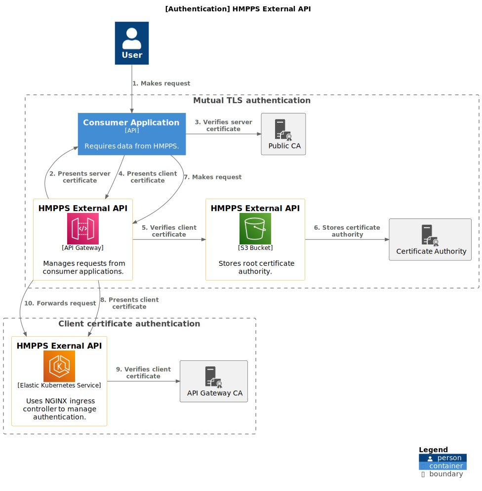

# Diagrams <!-- omit in toc -->

The [C4 model](https://c4model.com/) is used for visualising the technical architecture of the service.

## Contents <!-- omit in toc -->

- [Core diagrams](#core-diagrams)
  - [Context diagram](#context-diagram)
  - [Container diagram](#container-diagram)
  - [Component diagram](#component-diagram)
- [Supplementary diagrams](#supplementary-diagrams)
  - [Deployment diagram](#deployment-diagram)
  - [Infrastructure diagram](#infrastructure-diagram)
  - [Testing strategy diagram](#testing-strategy-diagram)
  - [Certificates diagram](#certificates-diagram)
  - [Authentication diagram](#authentication-diagram)

## Core diagrams

### Context diagram

The [context diagram](https://c4model.com/#SystemContextDiagram) provides a high-level overview of the current systems
that make up HMPPS Integration API as well as those that are yet to be implemented.

### Container diagram

The [container diagram](https://c4model.com/#ContainerDiagram) provides a more in-depth view of the different upstreams
APIs that are used to retrieve data from the HMPPS systems such as
the [Prison API](https://prison-api-dev.prison.service.justice.gov.uk/swagger-ui/index.html) for NOMIS.

### Component diagram

The [component diagram](https://c4model.com/#ComponentDiagram) provides an overview of our code architecture.

## Supplementary diagrams

### Deployment diagram

The [deployment diagram](./deployment.svg) provides a directional flow diagram that illustrates how the application is deployed.

### Infrastructure diagram

### Testing strategy diagram

### Certificates diagram

Certificates are used to secure the components that make up our API. 
When trying to troubleshoot any issues, it is important to remember that we use **two** types of certificates in our authentication model, which realistically might have different expiration dates, and therefore would require distinct renewal processes.

There are two levels of authentication:

1. Mutual TLS authentication which ensures requests only come from expected consumers. This requires both the client (consumer application) and server (API Gateway) to prove their identity.
2. Client certificate authentication which ensures requests only come from API Gateway. This requires only the client (API Gateway) to prove their identity.

**Mutual TLS:**
1. We create a root Certificate Authority (CA) certificate and a private key.
    - We store our CA certificate (truststore.pem) in an S3 bucket in order for API Gateway to verify the identity of a consumer application.
    - We store our private key in a Kubernetes secret (api-gateway-certificate-authority) so that we can generate client certificates.
2. For the consumer application, we create a client certificate (client.pem), which includes their public key. We also create their private key (client.key).
3. We send both the client certificate (client.pem) and the private key (client.key) to the consumer application to be used for mutual TLS. 
4. To inspect the certificate, retrieve and decode the public key, using this command to get it: `kubectl get secret mutual-tls-auth -n hmpps-integration-api-$environment -o json | jq -r '.data."truststore-public-key"' | base64 --decode`. Then decode the SSL certificate.

**Client Certificate Authentication:**
1. We use Terraform to get API Gateway to create a client certificate (apigw_client.pem), which includes their public key.
    - The resource we use to instruct API Gateway to generate a client certificate is "aws_api_gateway_client_certificate". 
    - The public key is included in the certificate, while the private key (apigw_client.key) is managed internally by API Gateway and is not exposed. 
2. The generated client certificate (apigw_client.pem) is retrieved and stored in a Kubernetes secret. 
    - The Terraform resource which stores the certificate is "kubernetes_secret".
    - "kubernetes_secret" takes the PEM-encoded certificate from the API Gateway resource and stores it under a specified key (e.g., ca.crt) within the secret.
3. To inspect the certificate, retrieve and decode the public key, using this command to get it: `kubectl get secret client-certificate-auth -n hmpps-integration-api-$environment -o json | jq -r '.data."ca.crt"' | base64 --decode`. Then decode the SSL certificate.

### Authentication diagram

The following diagram shows the journey of a request that originates from a user of a consumer application to our API.

1. A user makes a request to the consumer application.
2. API Gateway presents its server certificate to the consumer application to prove its identity.
3. The consumer application verifies the server certificate with our custom domain (`https://integration-api.hmpps.service.justice.gov.uk`) using their public certificate authority (CA).
4. The consumer application presents its client certificate to the API Gateway to prove its identity.
5. API Gateway accesses the S3 bucket that stores the root certificate authority.
6. API Gateway uses the CA certificate to verify the consumer application’s client certificate.
7. The consumer application makes a request to API Gateway.
8. API Gateway presents its client certificate to our API to prove its identity.
9. NGINX ingress verifies API Gateway's client certificate using API Gateway's CA.
10. API Gateway forwards the request to our API.

