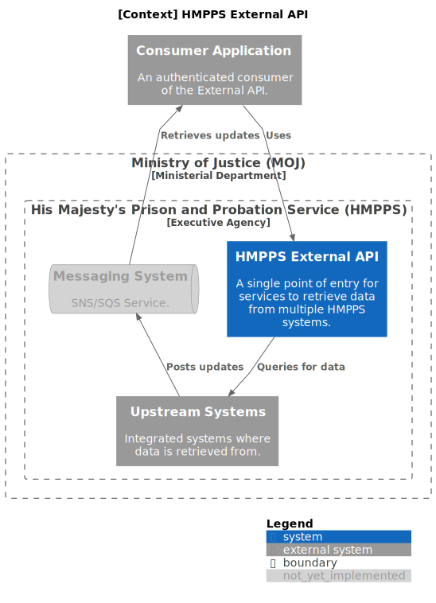

# Diagrams <!-- omit in toc -->

The [C4 model](https://c4model.com/) is used for visualising the technical architecture of the service.

## Contents <!-- omit in toc -->

- [Core diagrams](#core-diagrams)
  - [Context diagram](#context-diagram)
  - [Container diagram](#container-diagram)
  - [Component diagram](#component-diagram)
- [Supplementary diagrams](#supplementary-diagrams)
  - [Deployment diagram](#deployment-diagram)
  - [Infrastructure diagram](#infrastructure-diagram)
  - [Testing strategy diagram](#testing-strategy-diagram)

## Core diagrams

### Context diagram

The [context diagram](https://c4model.com/#SystemContextDiagram) provides a high-level overview of the current systems
that make up HMPPS Integration API as well as those that are yet to be implemented.

### Container diagram

The [container diagram](https://c4model.com/#ContainerDiagram) provides a more in-depth view of the different upstreams
APIs that are used to retrieve data from the HMPPS systems such as
the [Prison API](https://api-dev.prison.service.justice.gov.uk/swagger-ui/index.html) for NOMIS.

### Component diagram

The [component diagram](https://c4model.com/#ComponentDiagram) provides an overview of our code architecture.

## Supplementary diagrams

### Deployment diagram

### Infrastructure diagram

### Testing strategy diagram

